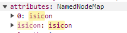
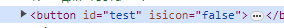

## Директивы

Это элементы, похожие на атрибуты тега с приставкой **v-**. Они используются для управления компонентом или элементом.

Например,

-   для назначения события `v-on` (сокр. @):

```
<button v-on:click="onClick"></button>
--- or ---
<button @click="onClick"></button>
```

-   для присвоения пропов/атрибутов/свойств

```
<basic-button v-bind:id="id"></basic-button >
--- or ---
<basic-button :id="id"></basic-button>
```

можно присвоить объединить свойства в объект, но присваивать тогда необходимо без сокращения

```
const buttonOptions = {
    id: 'main-btn',
    style: 'color:red;background-color:#fff'
}
```

```
<basic-button v-bind="buttonOptions"></basic-button >
```

**_кстати работает сокращение :="object" вместо v-bind="object"_**

если имя свойства и атрибута совпадают, то можно сократить до варианта:

```
<basic-button :id></basic-button >
```

---

У **v-bind** также есть модификаторы. Они позволяют провести некоторые манипуляции с передаваемым свойством.

`.prop` - позволяет передавать атрибут, как свойство DOM элемента. То есть такой атрибут нельзя записать в props компонента. Он будет принадлежать объекту тега.
Например,

_род. компонент_
```
<basic-button
    :isIcon.prop="false"
    >Редактировать</basic-button
```

_basic-button компонент_
```
<button
    :id="id"
    isIcon
></button>
```
Эти свойства будут принадлежать узлу DOM, но не будут видны в html-коде элемента.



Тогда, как `.attr` наоборот отобразит свойство, как дата-атрибут узла.



* * *

Слоты подразделяются на: по умолчанию и именные. Именные задаются `<slot name="title"></slot>`.
И чтобы его использовать, можно прописать **v-slot** или **#**:
```
<template v-slot="title">Title</template>
--- or ---
<template #title>Title</template>
```

Также директивы можно использовать в качестве условной отрисовки, например два варианта:
* `v-show` - показывает/отображает компонент с помощью свойства display
* `v-if` - скрывает/рендерит элемент в DOM по условию

Например,
```
<span v-if="isIcon">+</span>
```

Для вывода нескольких элементов/компонентов по массиву объектов можно использовать **v-for**. Важно не забывать о **key**, он _обязателен_, но не должен быть равен _индексу_ объекта массива.
```
<template>
    <ul>
        <li
            v-for="item in data"
            :key="item.id"
        >
            {{ item.date }}
            {{ item.category }}
            {{ item.price }}
            {{ item.comment }}
        </li>
    </ul>
</template>
```