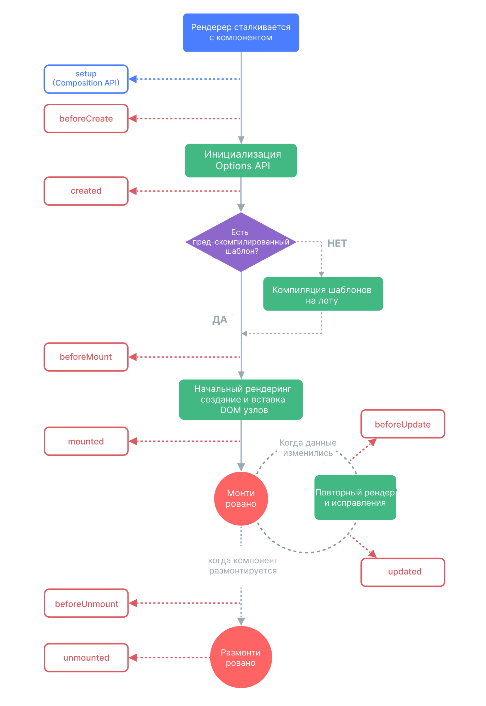

## Жизненные циклы приложения

Каждый компонент, а точнее экземпляр компонента проходит инициализацию. Когда компилируется, подключается к DOM или обновляет DOM, а также удаляется.
Весь путь сопровождается функциями-крючками (хуками).



Обычно используются: mounted, updated и unmounted.

Пример использования:
```js
onMounted(async () => {
    try {
        // запрос на сервер
    } catch (error) {
        console.log(error);
    }
});
```

То есть на данные хуки (функции-крючки) можно навесить какой-то набор действий. Например, сделать запрос на сервер при начальном рендеринге - **onMounted**. Когда создаётся DOM-структура, данные которой придут с сервера. 