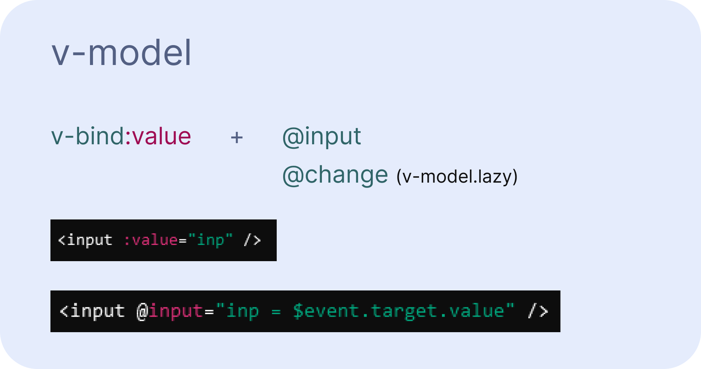

## v-model

Директива для реализации двунаправленной связки.
Основным примером использования можно считать связывание свойства и поля ввода формы.
Например,
```javascript
const inp = ref(0);
---
<input
    type="text"
    v-model="inp"
/>
```
_Так значение поля будет равно значению реактивной переменной inp и наоборот._

#### Как устроен v-model


Также v-model можно использовать для связывания родительского и дочернего компонентов. 

В версиях < 3.4 это реализовывалось через defineEmit. Однако с версии 3.4 появился макрос defineModel.

**Версия >= 3.4**
```javascript
// App.vue - родитель
const filter = ref();
---
<app-filters v-model="filter" />

// AppFilters.vue - ребёнок
const model = defineModel({
    type: [String, null],
    default: null,
});
-- or --
const model = defineModel();

function onSelect(value) {
    model.value = value;
}
```

Можно указать имя модели, тогда
```javascript
// App.vue - родитель
<app-filters v-model:filter="filter" />

// AppFilters.vue - ребёнок
const model = defineModel('filter');
```

**Версия < 3.4**
```javascript
// App.vue - родитель
const filter = ref();
---
<app-filters v-model:filter="filter" />

// AppFilters.vue - ребёнок
const model = defineProps({
    filter: [String, null]
});

const emit = defineEmits(['update:filter'])

function onSelect(value) {
    emit('update:filter', value)
}
```

У `v-model` есть модификаторы. Типа .lazy, это по событию @change, а не по @input. Также: .trim, .number.

Также можно создать свой модификатор, например, `.capitalize`
Чтобы получить bool модификатора нужно использовать деструктуризацию:
```javascript
const [model, modifiers] = defineModel({
  set(value) {
    if (modifiers.capitalize) {
      return value.charAt(0).toUpperCase() + value.slice(1)
    }
    return value
  }
})
// modifiers - Object {key: true/false}
```